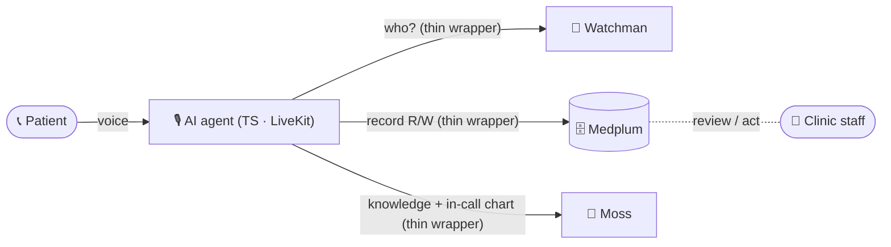
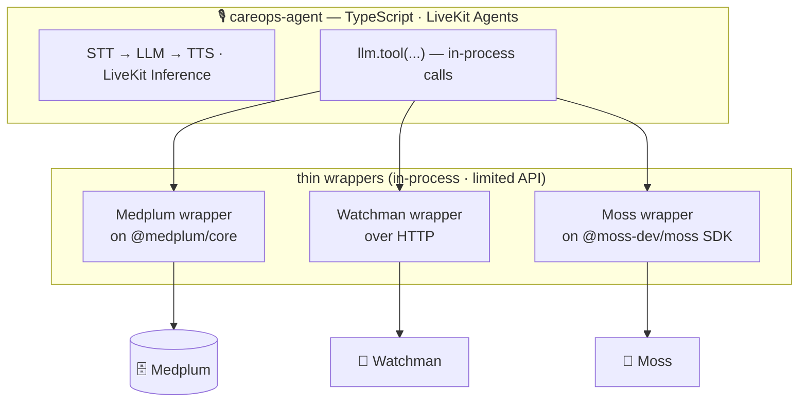
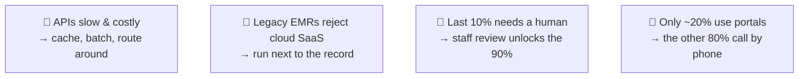
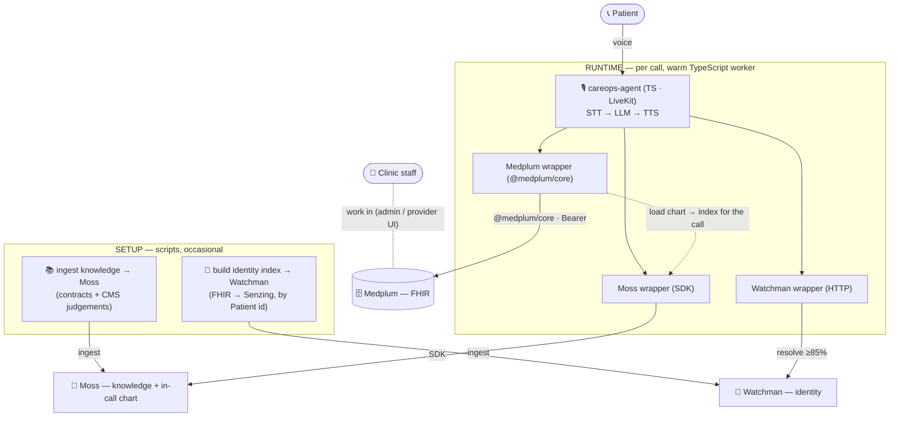

# Atomic Healthcare

> **Not one piece of software — a collection of small ones.** All TypeScript,
> each doing one job, that together let **AI agents work *with* humans to solve
> healthcare problems**.



## The moving parts

The agent and everything it touches are TypeScript. The agent's tools call **thin,
in-process wrappers** — no MCP, no HTTP tool server in between. Each wrapper
exposes only a **limited set of operations**, and that limited surface *is* the
safety boundary: the agent can't do arbitrary FHIR, only what a wrapper allows.



| Part | How it connects | Role |
| --- | --- | --- |
| 🎙️ **careops-agent** | TypeScript · LiveKit Agents (WebRTC / SIP) · LiveKit Inference | talks to the patient; STT → LLM → TTS, no provider key |
| 🗄️ **Medplum wrapper** | thin class on **`@medplum/core`** (`MedplumClient`), **in-process** | the FHIR system of record: verify/read patient, coverage, find & book appointments, tasks, call summaries — **only these operations**, not the whole API |
| 🪪 **Watchman wrapper** | thin **HTTP** call, in-process | identity: caller → **one** Patient id (≥85% match) or refuse |
| 🧠 **Moss wrapper** | thin class on **`@moss-dev/moss`** SDK, in-process | the knowledge base (contracts, past denials, CMS judgements, HEDIS gotchas) **and**, during a call, the resolved patient's chart — loaded from Medplum and **indexed in Moss for in-call retrieval** |

No MCP and no Hono tool server: the agent calls the wrappers as plain function
calls. Login is **idiomatic OAuth** — `@medplum/core` authenticates with a
client-credentials **ClientApplication** and refreshes the bearer itself. The real
guard rails are the **wrapper's limited API** plus Medplum's server-side
**AccessPolicy**. Swap any wrapper without touching the rest.

## What becomes possible

With verified context and the rules handled for it, the routine 90% runs itself
and a human partners on the hard 10%:

- verify a caller and open the right record — **only theirs**
- ground answers in the **actual contract**, not a guess
- book, reschedule, escalate — risky ones reviewed by staff in Medplum

## The blockers it removes



## Key innovations

What made all of this possible:

- 🪪 **Ultra-low-latency, HIPAA-compliant patient matcher.** Identity resolves
  against an **in-memory Watchman/Senzing** index (fuzzy match, every field
  optional, ≥90% gate) in **single-digit milliseconds** — and it runs **next to the
  record**, so PHI never leaves the environment to identify a caller.
- 🔒 **Secure agent ↔ EMR communication.** The agent never speaks raw FHIR. It calls
  **thin in-process wrappers** with a deliberately **limited API**, authenticated by
  **idiomatic client-credentials OAuth** (`@medplum/core` refreshes its own bearer)
  and bounded server-side by Medplum **AccessPolicy** — the wrapper surface *is* the
  safety boundary.
- 🤖 **Extends to RPA via CLI.** The same wrappers are plain functions, so they're
  drivable from the command line — a path to automate **legacy EMRs that have no
  modern API** the way a human clicks through them, without changing the agent.
- 📶 **Works on the edge.** All TypeScript, in-process, **VAD-only** turn-taking (no
  heavy ONNX model required) — the whole worker runs **alongside the record on
  constrained, on-prem hardware**, not a cloud SaaS the legacy EMR would reject.

## Architecture



Once Watchman resolves the caller to one Patient, the agent loads that chart from
Medplum and **indexes it in Moss for the duration of the call**, so the
conversation can draw on it across turns.

**Credentials** are configured via the environment (idiomatic OAuth): `@medplum/core`
authenticates with the Medplum **ClientApplication** (client-credentials) and
refreshes the bearer itself; Moss and Watchman use static keys. What the agent may
do is bounded by the **wrapper's limited API** and Medplum's server-side
**AccessPolicy**.

## Run it

**Prerequisites:** Bun · Docker · native PostgreSQL (`:5432`) · native Redis (`:6379`).
First-time host setup (Redis password, `medplum` database) is in
[`docs/getting-started.md`](./docs/getting-started.md).

```bash
bun install
make run-backing-services    # Medplum API :8103 · admin UI :3005 · Watchman :8084
make ingest-knowledge        # contracts + recent CMS judgements → Moss
make seed                    # demo cohort → Medplum + Watchman (identity)
make run-careops-agent       # launch the agent
```

Config is via environment variables (`MEDPLUM_BASE_URL`, the ClientApplication
id/secret, Moss + Watchman keys). The clinician/front-office UI (Medplum's provider
app) runs alongside for human review — see [`docs/getting-started.md`](./docs/getting-started.md).

## Examples

| Example | What it is |
| --- | --- |
| [`careops-agent`](./examples/careops-agent) | CareOps Voice — after-hours managed-care intake. TypeScript · LiveKit · Medplum (`@medplum/core`) · Watchman · Moss. |

## Principles

1. **A constellation, not a monolith.** Small TypeScript components, each doing one
   job — swap one without touching the rest.
2. **The wrapper is the boundary.** The agent only reaches a service through a thin
   wrapper with a limited API — plus Medplum's server-side AccessPolicy.
3. **Identity gates access.** No record opens until Watchman confirms the caller.
4. **Knowledge grounds decisions.** Coverage comes from contracts in Moss, not the
   model's imagination.
5. **The record is pluggable.** FHIR is the reference; any EMR slots in behind it.
6. **Humans own the edge.** Routine flows are autonomous; risky writes are
   reviewed by staff in Medplum.

Conventions: [`AGENTS.md`](./AGENTS.md).

## License

[MIT](./LICENSE).
