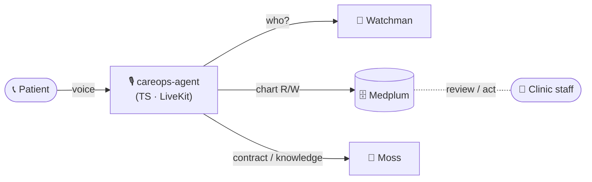
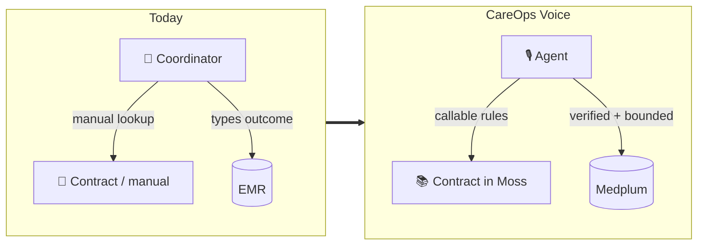
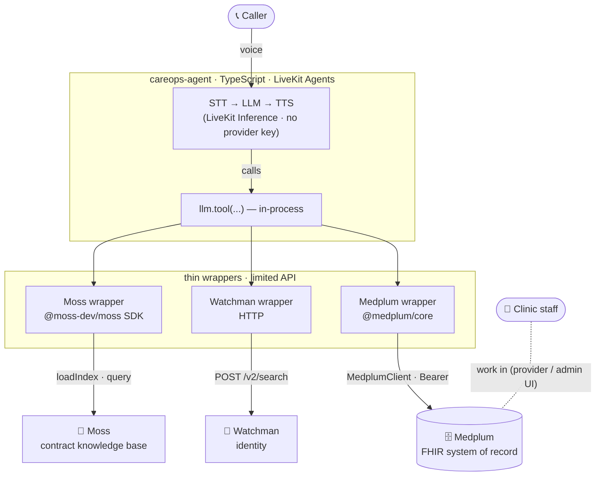
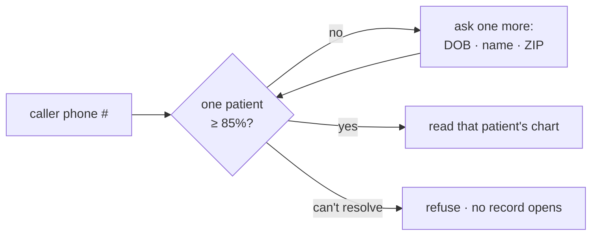

# careops-agent — CareOps Voice

> A voice agent for **after-hours managed-care operations**. It verifies the
> caller, grounds itself in their chart and the contract, then books a visit or
> escalates — every outcome written to the record, the hard ones left to a human.
> TypeScript, built on the Atomic Healthcare components.

---

## At a glance



---

## The job



After-hours obligations (coverage rules, access requirements, care gaps) live
*outside* the EMR. CareOps Voice makes those rules **callable** so the agent can
safely decide what happens next — and writes the result back as the record.

---

## The call, end to end

```mermaid
sequenceDiagram
    participant C as 📞 Caller
    participant A as 🎙️ Agent
    participant W as 🪪 Watchman
    participant M as 🗄️ Medplum
    participant S as 🧠 Moss
    C->>A: calls after hours
    loop until ONE patient ≥ 85%
        A->>W: resolve_patient(phone + answers)
        W-->>A: candidates / one match
    end
    A->>M: read chart (patient · coverage · appointments)
    A->>S: get contract rule + HEDIS/CMS gotchas
    Note over C,A: agent collects symptoms by voice;<br/>deterministic rules decide urgency
    alt routine
        A->>M: book appointment
    else urgent / ambiguous
        A->>M: create escalation (→ staff review)
    end
    A->>M: write call summary
```

---

## Architecture (how it connects)

The agent's `llm.tool(...)` functions call **thin, in-process wrappers** — no MCP,
no Hono tool server. Each wrapper exposes only a limited set of operations.



Credentials are injected at launch — **no `.env` in source**. The Medplum wrapper
authenticates `@medplum/core` with the **ClientApplication** (client-credentials);
the SDK refreshes the bearer itself. Moss and Watchman use static keys. What the
agent may do is bounded by the **wrapper's limited API** + Medplum's server-side
**AccessPolicy**.

---

## Identity gate — only the patient gets in



Watchman does the fuzzy "which person is this" match — not a plain FHIR
`name + birthdate` search (which can return several people). Once Watchman returns
one Patient id, the Medplum wrapper reads that chart by id.

---

## Tools the agent has

Each tool is a function whose body calls one thin wrapper:

| Tool | Wrapper | Does |
| --- | --- | --- |
| `resolve_patient` | Watchman (HTTP) | caller → one Patient id (≥85%) or refuse |
| `get_contract_context` | Moss (SDK) | contract / policy context + HEDIS/CMS gotchas |
| `get_patient_context` | Medplum (`@medplum/core`) | read chart: patient, coverage, appointments |
| `find_available_appointments` | Medplum | open slots for a service / schedule |
| `book_appointment` | Medplum | book the visit (staff-reviewable) |
| `check_existing_booking` | Medplum | avoid duplicates (e.g. A1c care-gap) |
| `create_human_handoff` | Medplum | stat Task for urgent / emergency |
| `create_nurse_task` | Medplum | routine nurse follow-up Task |
| `record_questionnaire` | Medplum | QuestionnaireResponse (symptoms) |
| `log_call_summary` | Medplum | Communication / call summary |

Demo scenarios: routine primary-care booking · A1c care-gap duplicate check ·
emergency human handoff · non-emergency nurse follow-up.

---

## Deterministic safety

> The LLM **converses and summarizes**. It is never the final authority on
> eligibility, triage, or booking — seeded contract rules decide those, and
> anything urgent or ambiguous is escalated to a human.

---

## Run

```bash
# from the project root
make run-backing-services            # Medplum :8103 · admin UI :3005 · Watchman :8084
atomic-healthcare ingest-knowledge   # contracts + recent CMS judgements → Moss
make seed                            # demo cohort → Medplum + Watchman (identity)
make run-careops-agent               # launches this agent (secrets injected at launch)
```

